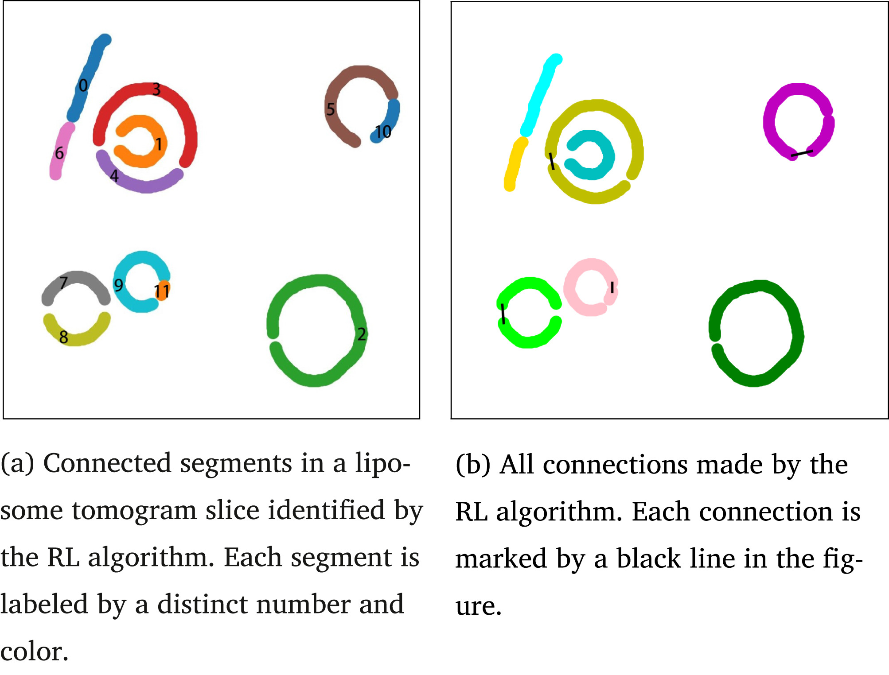

# CryoET Object Identification - Supervised 3D Image Segmentation

[NOTE! Project is ongoing. Please see the [Presentation](https://github.com/ZahirAhmadChaudhry/Cryo-ET-Object-Detection-and-Segmentation-Kaggle/blob/main/presentation/Cryo_ET_Presentation.pdf) for latest updates on the project]

This repository showcases our ongoing effort to develop a **3D U-Net**-based framework for detecting and classifying multiple protein complexes within cryo-electron tomograms (cryoET). We are participating in the [Kaggle Challenge “CryoET Object Identification”](https://www.kaggle.com/competitions/czii-cryo-et-object-identification), which involves accurately finding the centroid coordinates of up to five particle types—some of which are considered easier (apo-ferritin, virus-like particles, ribosomes) and some harder (thyroglobulin, β-galactosidase). By tackling this challenge, we hope to further computational biology research by clarifying protein spatial organization in a near-native environment.

Our journey began by **preprocessing and visualizing raw tomograms** stored in `zarr` format, each representing a 3D volume of voxel intensities. We then integrated ground-truth coordinates, provided in `JSON` files, to create labeled 3D targets for supervised training. Our **initial baseline** was a straightforward **3D U-Net** segmentation pipeline, which we tested on a few tomograms to confirm the viability of voxel-wise classification at this scale.

Recognizing the complexities of cryoET data—including significant noise, variable contrast, and large file sizes—we explored **synthetic data generation**. By simulating approximate intensities and shapes for different protein complexes, we aimed to expand the training set and reduce domain gaps between real and synthetic volumes. Simultaneously, we devised a **multi-phase approach** for inference:

1. **3D U-Net** multi-class training to obtain probability volumes for each particle type.  
2. **Thresholding and local maxima detection** for coarse region proposals.  
3. **Non-maximum suppression (NMS)** and radius constraints to refine candidate centroids.  
4. **Optional 3D smoothing** to address artifacts or noisy boundaries.  
5. **Final coordinate extraction** in CSV submission format, aligning with Kaggle’s specifications.

An important aspect of our evaluation is the **F-beta metric with β = 4**, which strongly emphasizes recall. Missing hard-to-detect particles (like thyroglobulin or β-galactosidase) is more heavily penalized than introducing a few false positives. This approach ensures that the rare but biologically significant complexes are identified whenever possible, even if it means tolerating some over-segmentation in easier classes.

In pursuit of higher accuracy, we have begun testing **contrast enhancement** and **region merging** techniques, inspired by Li Zhou et al. (2023), to better connect fragmented segments. We are also incorporating incremental **3D refinement** steps—potentially leveraging reinforcement learning or classical morphological operations—to fill in missing boundaries. On the computational side, we continue to fine-tune **hyperparameters** like learning rates, batch sizes, and voxel-level augmentations, while exploring different **loss functions** (e.g., Tversky or Dice) that might align better with the F-beta measure used in final scoring.

Our roadmap includes expanding the pipeline to handle more tomograms at scale, employing distributed training, and refining the local maxima detection to handle partial or overlapping particles. We also plan to experiment with **synthetic data mixing** strategies and advanced augmentation to bolster generalization. The final step will be preparing the best models for a robust Kaggle submission, complete with an extensive 3D failure analysis and improved detection of even the most elusive complexes.
