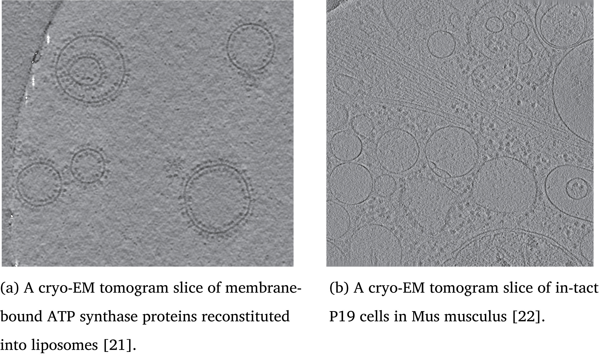
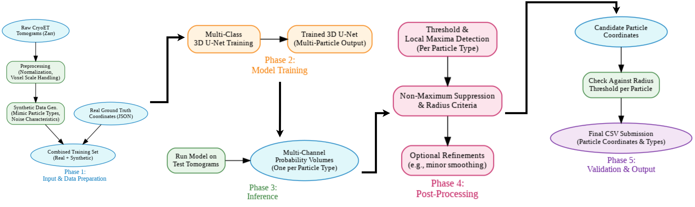
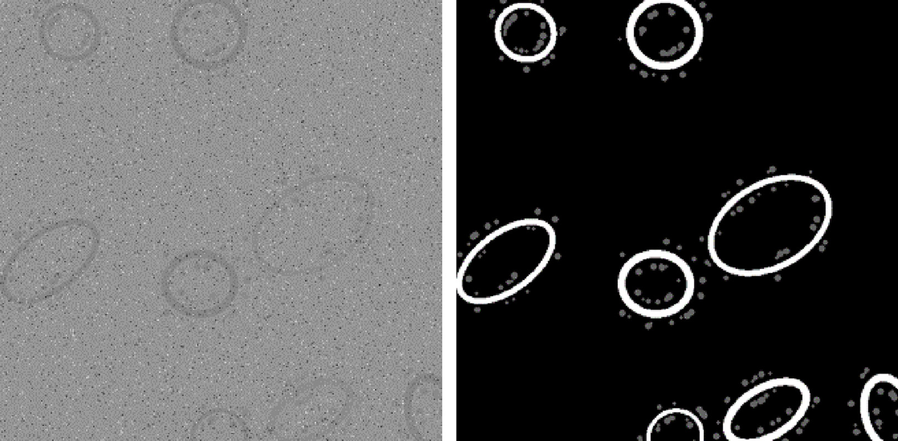
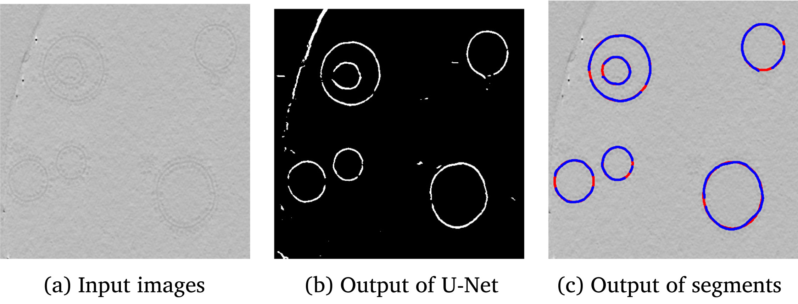
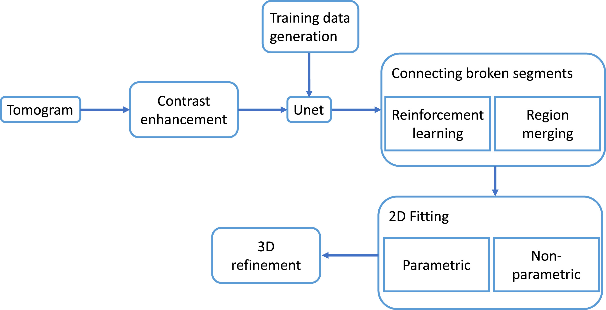

# CryoET Object Identification - Supervised 3D Image Segmentation

This repository presents our completed work on detecting and classifying multiple protein complexes within cryo-electron tomograms (cryoET) for the [Kaggle Challenge "CryoET Object Identification"](https://www.kaggle.com/competitions/czii-cryo-et-object-identification). The challenge involves accurately finding the centroid coordinates of five particle types, classified by detection difficulty:

- **Easy Particles**: apo-ferritin (60nm radius), virus-like particles (135nm radius), ribosomes (150nm radius)
- **Hard Particles**: thyroglobulin (130nm radius), β-galactosidase (90nm radius)


*Figure: Example tomogram slice showing protein complexes in their cellular environment*

## Project Overview

We implemented and compared **three distinct deep learning architectures** to address the unique challenges of cryoET data, including low signal-to-noise ratios, missing wedge artifacts, and crowded cellular environments:

1. **DeepFindET ResNet Model** - 3D residual U-Net for volumetric segmentation
2. **Faster R-CNN** - 2D region-based object detection with transfer learning
3. **YOLO + 3D U-Net Ensemble** - Hybrid approach combining 2D detection with 3D refinement


*Figure: Complete pipeline workflow for protein complex detection*

## Dataset and Preprocessing

Our dataset comprised seven tomogram images from the cryoET data portal, provided as multiscale 3D OME-NGFF Zarr arrays with 10nm voxel spacing. Ground-truth particle locations were stored in JSON files containing precise x, y, z coordinates of object centroids.

**Data Preparation:**
- Converted Zarr files into appropriate formats for each architecture
- Generated segmentation masks using the copick framework
- Split data into training (TS64, TS736, TS66, TS999), validation (TS863), and test sets (TS54, TS692)
- Applied denoised tomogram versions for all experiments


*Figure: Annotation and labeling workflow for training data*

## Methodology

### 1. DeepFindET ResNet Model

**Architecture:**
- Residual U-Net with encoder-decoder structure
- Residual blocks with 3D convolutions, batch normalization, and LeakyReLU
- Filter configurations: [48, 64, 80]
- Input dimension: 72×72×72 voxels

**Training Configuration:**
- Optimizer: Adam (learning rate: 0.0001)
- Loss Function: Tversky Loss (designed for class imbalance)
- Batch size: 5
- Training time: 1.5-2.5 hours on SLURM cluster

**Results (F-beta β=4):**
| Particle Type | Precision | Recall | F1 Score | F4 Score |
|--------------|-----------|--------|----------|----------|
| Apo-ferritin | 0.320 | 0.395 | 0.354 | 0.390 |
| Ribosome | 0.625 | 0.441 | 0.517 | 0.449 |
| Thyroglobulin | 0.134 | 0.422 | 0.203 | 0.374 |
| Beta-galactosidase | 0.089 | 0.429 | 0.147 | 0.350 |
| **Overall** | **0.219** | **0.464** | **0.297** | **0.435** |

### 2. Faster R-CNN

**Architecture:**
- ResNet backbone with Region Proposal Network (RPN)
- 2D slice-based processing with bounding box detection
- Adapted anchor boxes for protein particle scales

**Key Findings:**
- Achieved best performance on ribosomes (67.6% recall)
- Struggled with smaller particles due to 2D limitations
- Computational overhead limited rapid experimentation

**Results (F-beta β=4):**
| Particle Type | Precision | Recall | F1 Score |
|--------------|-----------|--------|----------|
| Ribosome | 0.211 | 0.676 | 0.322 |
| Thyroglobulin | 0.154 | 0.594 | 0.244 |
| Beta-galactosidase | 0.034 | 0.071 | 0.046 |
| Virus-like-particle | 0.073 | 0.263 | 0.114 |

**Limitations:**
- Loss of 3D spatial context in slice-based approach
- Poor performance on small/irregular particles
- High computational cost relative to accuracy gains

### 3. YOLO + 3D U-Net Ensemble with Post-Processing

**Base Architecture:**
- YOLO (V8) for efficient 2D detection across slices
- 3D U-Net for volumetric refinement
- Ensemble integration through weighted voting

**Post-Processing Enhancements:**
We developed and tested three post-processing strategies:

1. **Intensity-Based Validation** - Failed (significant performance drop)
2. **Light Merging** - Neutral (predictions already well-spaced)
3. **Hard Particle Enhancement** - **Success** (targeted offset generation)

**Final Results with Hard Particle Enhancement:**
| Particle Type | Base F-beta | Enhanced F-beta | Improvement |
|--------------|-------------|-----------------|-------------|
| Apo-ferritin | 0.7272 | 0.7272 | - |
| **Beta-galactosidase** | 0.6586 | **0.8073** | **+14.87%** |
| Ribosome | 0.8344 | 0.8344 | - |
| **Thyroglobulin** | 0.7299 | **0.8992** | **+16.93%** |
| Virus-like-particle | 0.8774 | 0.8774 | - |
| **Overall** | **0.7451** | **0.8101** | **+8.7%** |


*Figure: Complete detection and post-processing pipeline*

## Evaluation Metrics

All models were evaluated using the **F-beta metric with β = 4**, which emphasizes recall over precision:

```
F_β = (1 + β²) × (Precision × Recall) / (β² × Precision + Recall)
```

This metric prioritizes finding all particles (minimizing false negatives) over avoiding false positives, reflecting the biological importance of detecting rare protein complexes. A prediction is valid if its distance from the true centroid is less than half the particle's radius.


*Figure: Systematic approach to model development and evaluation*

## Comparative Analysis

### Performance Summary (F-beta β=4):
| Architecture | Avg Recall | Avg Precision | Overall F-beta |
|-------------|-----------|---------------|----------------|
| DeepFindET ResNet | 0.47 | 0.38 | 0.45 |
| Faster R-CNN | 0.29 | 0.12 | 0.17 |
| **YOLO + 3D U-Net** | **0.82** | **0.76** | **0.80** |

### Key Insights:

1. **3D Context Matters**: Methods preserving volumetric relationships significantly outperformed 2D approaches
2. **Hybrid Efficiency**: Combining 2D detection with 3D refinement achieved the best accuracy-compute balance
3. **Targeted Enhancement**: Hard particle-specific post-processing substantially improved detection without degrading easy particle performance
4. **Class Imbalance Challenge**: All methods required specialized handling of rare particle types

### Computational Requirements:
| Architecture | VRAM (GB) | Time/Epoch | Inference (s/slice) |
|-------------|-----------|------------|---------------------|
| DeepFindET | 24.1 | 2.1h | 4.2 |
| Faster R-CNN | 11.3 | 1.7h | 1.1 |
| YOLO + U-Net | 18.7 | 3.4h | 2.8 |

## Biological Impact

Our improved detection capabilities have direct medical and research applications:
- **Ribosomes**: Enhanced detection supports antibiotic development research
- **Virus-like particles**: Informs vaccine development and antiviral treatments
- **Thyroglobulin**: Aids thyroid disease diagnosis and treatment
- **β-galactosidase**: Important for metabolic disease research


## Conclusions

This project demonstrated that:
1. **Ensemble approaches** combining complementary architectures outperform single-model solutions for cryoET protein detection
2. **Targeted post-processing** can significantly improve hard particle detection (+15.9% average) without sacrificing easy particle performance
3. **3D volumetric processing** is essential for handling missing wedge artifacts and spatial relationships in cryoET data
4. **Class-specific strategies** are necessary to address the varying difficulty levels of different protein complexes

## Future Directions

Potential improvements for future work:
- Native 3D architectures specifically designed for missing wedge artifacts
- Hybrid feature extraction combining local and global contextual information
- Adaptive ensemble strategies adjusting to varying noise levels and particle densities
- Domain-specific data augmentation and synthetic data generation
- Real-time inference optimization for clinical applications

## References

For detailed methodology, mathematical formulations, and comprehensive results, please refer to our full project report: [Cryo_ET_Project_Report.pdf](Cryo_ET_Project_Report.pdf)

---

## Authors

**Zahir AHMAD**  
Master Machine Learning and Data Mining (MLDM) \
Jean Monnet University

**Amgad KHALIL**  
Master MLDM  
Jean Monnet University

**Josh TRIVEDI**  
Master MLDM  
Jean Monnet University

---

**Competition**: [Kaggle - CryoET Object Identification](https://www.kaggle.com/competitions/czii-cryo-et-object-identification)
